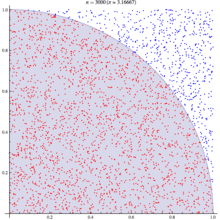

# 1，事件
    事件的运算:
        包含关系, 如果A发生必然导致B到发生，称事件B 包含事件A
        和事件，多个事件中至少有一个发生
        积事件，多个事件同时发生
        对立事件和互斥事件，对立的事件肯定互斥，互斥的事件不一定对立
            两个事件如果对立，那么必须二选一，必然发生一个
            两个事件如果互斥，那么可以都不发生，但是不能同时发生
        事件A发生而事件B不发生所构成到事件为事件A于事件B到差事件 A-B
    事件运算的性质:
        设A B为随机事件，A的对立事件用 _A_ 表示
        
        交换律
            A ∪ B = B ∪ A ,AB=BA
        结合律
            (A ∪ B) ∪ C = A ∪ (B ∪ C)
        分配律
            (A ∪ B)C = AC ∪ BC
            (AB) ∪ C = (A∪C)(B∪C)
            
        对偶律
            A与B的和事件的 对立事件 等于 事件A的对立事件与B的对立事件的积
            __A ∪ B__ = _AB_
            (_AB_) = _A_ ∪ _B_
            
    古典概型
        等可能事件模型
        求取此类事件的概率时，需要注意分子分母的计算方法需要相同
        静态比例到动态的转换
        静态: 比如10个小球有6个红色， 红色小球的比例是 6/10
        动态: 取出一个球，为红色的概率，摸到红球的概率 6/10
        有放回的连续取两次，都是红色的概率  0.6*0.6 = 0.36
        
        例子:
            A,B,C样本空间S中三个随机事件
            至少两个发生
                _A_BC + A_B_C + AB_C_ + ABC  或 AB ∪ AC ∪ BC
            至少一个发生
                A ∪ B ∪ C
            恰好两个发生
                _A_BC + A_B_C + AB_C_
        
## 1.1, E 事件 （event）描述
    P(E) 事件的概率
    试验 trial， 检测 E 发生情况的过程   
                 
# 2，概率分类
           
    频率论(frequentism)
        可以重复试验，得到发生次数的就是概率，比如一系列假象可重复的试验，比如抛硬币
        适用于：物理系统 如原子衰变，无法预测被视为随机的系统如意外死亡。
        问题: 适用范围比较小
        
    贝叶斯认识论(bayesianism)
        未知的事情其发生也可以有概率，比如 Trump(川普) 在2020年当选的概率
        概率是 事件发生的可信度
        适用于几乎所有情况
        问题: 有较强的主观性， 不同的人掌握的信息不一样，对事件发生的可信度判断也不一样

    
## 2.1,概率法则
    频率概率:
        1，P(AB) = P(A)P(B)   # A 和 B 同时发生的概率， A B 相互独立，相互发生没有影响，比如A 是 抛硬币正面，B事件是骰子 6 点
        
        2，如果有关系的两个事件，A是 得到一次硬币正面，B是得到两次硬币正面，那么
            A 发生了，B 发生的概率会增加
            B 发生了，A 发生的概率就是 1， 即100%
        3，如上两个事件不独立，就需要计算条件概率P(A|B)， 即在
            事件B已经发生，A发生的概率 P(A|B)
            P(A|B) = P(AB) / P(B)   ===推导==> P(AB) = P(B)P(A|B) = P(A)P(B|A) 
        4, 同时发生的含义，与事件发生的先后顺序没有关系，以上表达式，无论A，B是否独立都是成立的
            P(AB) <= P(A)   # P 范围 (0,1)
            以上表达式可以举例为: 某俱乐部加入需要满足条件A， 如果再加上需要同时满足条件B，则俱乐部规模变小，即成功加入的概率变小
        * 5, 互斥的事件，条件概率为0, 即 A 和 B只有一个会发生
            P(A|B) = P(B|A) = 0  
            互斥事件，A和B， A发生，B发生，A，B都发生的概率
            P(A或B) = P(A) + P(B) - P(AB)
          
          
## 2.2,蒙提霍尔问题的简单实践
    简单描述如下:
        有3个选项，A，B，C 有一个是正确的
        你预选了A为正确的，这时裁判告诉你，B是错误的，那么还剩下A，C是 可能是正确的
        你是否改选答案为 C ？
        蒙提的回答是: 如果 不改答案，你正确的概率是 1/3
                     如果改答案，正确的概率是 2/3
    # 尝试计算机模拟来验证
    模拟结论
    0，所有情况不重新选择，那么成功概率 为 1/3 即 33% 上下
    1， 如果第四步是从错误答案中排除一个选项，重新选择后 成功概率为 50%上下
    2，如果第四步是从全部答案中排除一个选项，重新选择后 成功概率为 33%上下
    
## 2.3, 变异系数(coefficient of variation)
    比较两组 正态分布数据的变化程度,一般 是 𝛔/𝝁

# 3, 二项式分布(binomial distribution)举例
    掷100次骰子，
        全部为 6点的 概率为 (1/6) ** 100， 
        0 次 6点都没有的情况(5/6) ** 100
        k 次6点的概率 PMF(k) = (n,k) p**k (1-p)**(n-k)
            n 是试验总次数， p是成功概率， k是成功次数
            (n,k) 读着 n中选k
            计算 (n k) = n! / k! * (n-k)!
            或  (n k) = (n-1 k) + (n-1 k-1) 
    
    另一个情况如 抛100次硬币，
        恰好50次正面向上的概率是多大？
        通过计算机模拟可以知道， 出现 0 ～ 100的概率分布符合正态分布的模型。 即 在50次频次附近 概率最大。
        
    
# 4, 聚类错觉(clustering illusion) 和  蒙特卡罗 模拟(Monte Carlo simulation) 的关系
    指样本 好像有某种特征的聚类，实际是随机的
    要检查某个聚类是否有意义，可以试验一种随机模拟系统， 查看在随机情况下，产生这种聚类的概率。
    
    这种过程叫 蒙特卡罗 模拟(Monte Carlo sinmuation) --- 一个来自赌场的随机方法。 
        优点: 编写模拟简单快速，不需要对概率有深入的了解
        缺点: 罕见事件的模拟需要大量计算资源；
    * 需要实践编写。

# 5, 贝叶斯定理(Bayes's theorem)的性质和应用
    * 依赖先验概率，但是即时有初始指定了不同的先验概率，最后也倾向于收敛
    
    描述条件概率之间的关系，
        P(A|B) = P(B|A)P(A)/P(B)
    通常可用于解释某特定证据E 如何影响假设H的概率
        P(H|E) = P(H) * (P(E|H)/P(E))
        
    * 历时性解读(diachronic):
        假设成立的概率随时间发生的变化，这种变化一般是因为新的证据的出现。
    * 先验概率(prior probability)
        这时，P(H)称为先验概率，先验概率一般假设得到，比如通过高斯函数假设
        表示各种原因发生的可能性大小
        
    * 后验概率(posteror probability)
        P(H|E) 称为后验概率，反映了当试验产生结果A之后，再对各种原因概率的新的认识
        后验概率可以描述为:
            H 的概率，先验概率 乘以 似然概率 与 归一化常量(全概)的比值
        H_a 为效应存在，N 效应不存在
        P(H_a|E) = P(E|H_a)P(H_a) /  P(H_a)P(E|H_a) + P(N)P(E|N)
        
    * 似然值(likelihood of evidence)
        
        P(E|H) 称为证据E的似然值
        即用药且 检测结果为阳性的概率
        
    * 似然比(likelihood ratio) 也称做 贝叶斯因子(bayes factor)
        一般的: 似然比 大于1，表示新的证据 支持效应存在
        P(E|H_a) / P(E|H_0)
        根据似然比，人们可以根据自己的需要设置先验概率和后验概率
        
    * 归一化常量(normalization constant)
        P(E)  任何情况下发生事件 E 的概率， 可以通过全概公式计算
        如果H为用药的假设，N为没有用药的假设，E为检测结果 阳性
        P(E) = P(H)P(E|H) + P(N)P(E|N)   # 全概公式 ∑(i, ∞)P(Bi)P(A|Bi)
        
    P(E|H)/P(E) 可以解释为：H为真的情况下 看到 E的概率 与 任何情况下看到E的概率的 比值。
    
    经典应用与临床检测的解读:
        检测结果需要满足
        敏感性: 当样本中有药物或代谢物时，是阳性的
        特异性: 当样本中没有药物，得到 阴性结果
        
## 5.1, 贝叶斯 似然比应用问题
    问题: 假设 事件 H 的先验概率为 0.3， 之后我们观测到了新的证据E， 而且此时的似然比 P(E|H) / P(E|N) 为3
    这种情况下 H 的后验概率是多少
    推导过程:
        P(H|E) = P(H)P(E|H) / P(E)    (1)
        
        根据全概公式, H 为效应存在，N为效应不存在，E为效应新证据
        P(E) = P(H)P(E|H) + P(N)P(E|N)  (2)
        已知 P(H) = 0.3 
        P(E|N) = P(E|H) / 3
        
        (2) 代入 (1) 
        P(H|E) = P(H)P(E|H) / P(H)P(E|H) + P(N)P(E|N) (3)   
        
        
        各数据代入 (4) 消除变量 P(E|H)
        
        P(H|E) = 0.3 * P(E|H)  / 0.3 * P(E|H) + 0.7 * (P(E|H) / 3)
               = 0.3 * P(E|H)  / 0.3 * P(E|H) + (0.7/3) * P(E|H)
               = 0.3 / 0.3 + (0.7/3) 
               = 0.9 / (0.9 + 0.7) = 9 / 16 = 0.5625
    所以 H 的后验概率 0.5625, 大于先验概率 0.3，即证据E的出现，支持了效应 H 的真实性
                
        
## 5.2, 贝叶斯 应用问题一:
    可信度的度量
    医学协会表示，常规药检的灵敏度大约是 60%, 特异性大概是 99% (特异性是指 没有用药，而且检测结果为阴性)
    假设有一个比例 5% 的职工人群使用了违禁药物，检查结果为阳性的雇员 有多少真正使用了违禁药物？
    
    利用贝叶斯理论，我们要计算的是当 检查结果为阳性适，用药的概率P(D|E)
        P(D|E) = P(D) * (P(E|D) / P(E))
        
        先验概率 P(D) 就是我们看到检查结果之前用药占比 5%， 
            对应的 P(N) 没有用药的人 占比为 95%
        似然值 P(E|D) 就是使用了违禁药物的情况下检查结果为阳性的概率 (灵敏度）
        归一化常量 P(E) -- 全概公式
            P(E|D) 使用了药物，被检查为阳性的概率, 
            P(E|N)  N代表受试者没有用药的假设，即没有用药 被检查为阳性的概率
            所以 P(E) = P(D)P(E|D) + P(N)P(E|N)
            假阳性的概率 P(E|N) 与特异性是互补的即 1%，所以
        
        P(D|E) = P(D)*P(E|D) / P(D)P(E|D) + P(N)P(E|N)
               = 0.05 * 0.6 /(0.05 * 0.6 + 0.95 * 0.01) = 0.03 / 0.0395 = 0.76 
        0.76 意味着每四个检查结果为阳性的 就有一个是被冤枉的
            
                
# 6, 大数定理(Law Of Large Numbers)
    概率和统计学中的大数定律表明，随着样本量的增长，其均值接近整个总体的平均值。
    瑞士数学家雅各布·伯努利在其着作“Ars Conjectandi”中证明了这一定理。后来其他着名的数学家对其进行了改进，
    例如圣彼得堡数学学院的创始人Pafnuty Chebyshev。在金融背景下，大数定律表明，快速增长的大型实体无法永远保持这种增长速度。
    
    在统计分析中，大数定律可以应用于各种主题。对特定人群中的每个人进行询问以收集所需数据量可能是不可行的，
    但所收集的每个数据点都有可能增加结果是平均值的真实度量的可能性。
    在商业中，大数法则与增长率相关，以百分比表示。大数法则表明，随着企业的扩张，增长率越来越难以维持。
    
    “大数定律”不应与“平均法则”相混淆，后者指出样本（大或小）的结果分布反映了人口结果的分布。
    统计原理:
        如果一个人想要确定100个可能值的数据集的平均值，他更可能通过选择20个数据点而不是仅依赖于两个数据点来达到准确的平均值。
        例如，如果数据集包括从1到100的所有整数，并且只取来两个样本了值，例如95和40，则他可以确定平均值大约为67.5。
        如果他继续随机采样20个变量，那么当他考虑更多数据点时，平均值应该转向真实平均值。
    
    商业原则:
        一个高收入的公司，和一个高增长的公司
        2015年7月，沃尔玛（Wal-Mart Stores Inc.）的收入记录为4855亿美元，而亚马逊（Amazon.com Inc.）同期收入为958亿美元。
        如果沃尔玛希望将收入增加50％，则需要约2428亿美元的收入。
        相比之下，亚马逊只需增加479亿美元的收入即可达到50％的增幅。根据大数法则，沃尔玛实现50％的增长将比亚马逊更难实现

        相同的原则可以应用于其他指标，例如市值或净利润。因此，投资决策可以基于具有非常高市值的公司在与股票增值相关时可以经历的相关困难来引导。
    
        
# 7, 全概公式(formula of total probability)
    其意义在于当直接计算A的概率困难的时候
    将事件A分解成几个小事件，通过求小事件的概率，然后相加从而求得事件A的概率，而将事件A进行分割的时候，不是直接对A进行分割，
    而是先找到样本空间Ω的一个个划分B1,B2,...Bn,这样事件A就被事件AB1,AB2,...ABn分解成了n部分，
    即A=AB1+AB2+...+ABn, 每一Bi发生都可能导致A发生相应的概率是P(A|Bi)
    然后相加样本空间Bi 发生导致A发生的概率的和
    
    事件组B1,B2...Bn 相互独立, B1 ∪ B2 ∪ B3 ... 组成样本空间 𝛺
    
    B1,B2,B3..
    设B1,B2.. 是样本空间 𝛺 的一个划分 A 为任意事件
    全概公式:
        P(A) = ∑(i, ∞)P(Bi)P(A|Bi)
        
        
# 8, 蒙特卡罗随机场(Monte Carlo method)
    * 1, 描述
    蒙特卡罗方法是一类广泛的计算算法，依赖于重复随机采样来获得数值结果
    也称统计模拟方法，是二十世纪四十年代中期由于科学技术的发展和电子计算机的发明，而被提出的一种以概率统计理论为指导的一类非常重要的数值计算方法。
    是使用随机数（或更常见的伪随机数）来解决很多计算问题的方法。
    着名的约翰·冯·诺伊曼（John von Neumann）认为它很好并且他们的ENIAC进行了编程以进行计算
    它也成为解决数学，物理，工程，金融以及人工智能等现实世界问题的既定方法。
    基本思想:
        1, 所求解的问题本身具有内在随机性，
        如物理学中子在反应堆的传输过程受到量子力学规律的制约，人们知道其发生的概率，但无法准确得知中子和原子核作用时的位置
        以及裂变产生的新中子的行进速率和方向。科学家依据其概率进行随机抽样得到裂变位置，速度和方向，模拟大量中子行为后，经过统计获得中子传输的范围，以此作为依据设计反应堆
        2，所求解的问题可以转化为某种随机分布的特征数
            随机事件出现的概率或者随机变量的期望值，通过随机抽样，以随机事件出现的频率估计其概率
            或者以抽样的数字特征估算随机变量的数字特征，并将其作为问题的解，多用于求解复杂的微积分问题。
    * 2， 应用:
        1, 积分，复杂积分
           非权重蒙特卡洛积分，也称确定性抽样，是对被积函数变量区间进行随机均匀抽样，然后对被抽样点的函数值求平均，
           从而可以得到函数积分的近似值。此种方法的正确性是基于概率论的中心极限定理 
           当抽样点数为m时，使用此种方法所得近似解的统计误差只与m有关，不随积分维数的改变而改变。因此当积分维度较高时，蒙地卡罗方法相对于其他数值解法更优
        2，求圆周率
            蒙特卡洛方法可用于近似计算圆周率：让计算机每次随机生成两个01之间的数，看以这两个实数为横纵坐标的点是否在单位圆内。
            生成一系列随机点，统计单位圆内的点数与总点数，（圆面积和正方形面积之比为PI:4，PI为圆周率）
            当随机点取得越多时，其结果越接近于圆周率（然而准确度仍有争议：即使取10的9次方个随机点时，其结果也仅在前4位与圆周率吻合）
    * 3， 缺点:
        蒙特卡罗近似方法有不足在于，计算机产生的随机数受到存储格式的限制，是离散的，不能产生连续的任意实数，求圆周率的方法将平面分割称一个个网格，空间上也是不连续的。
    
    
    * 4， 求圆周
    求圆周率过程, 随机数增加，准确度提升(网络图)
   
   
    100次随机模拟结果
   
   
    * 5，在机器学习，强化学习中的运用
        OpenAI
        
        
   